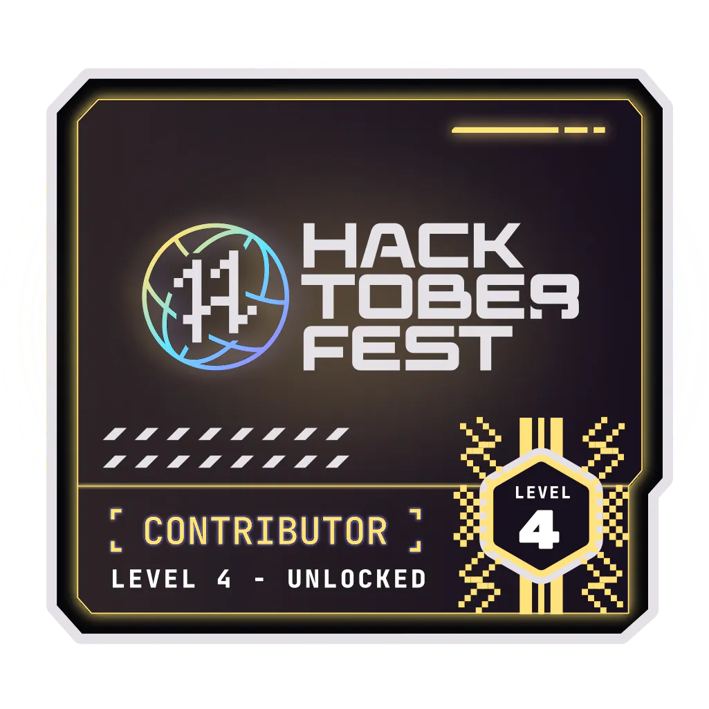

## Hey 👋, I'm [Amogh Rao!](https://github.com/Arioum/)

### Talking about Personal Stuffs:

- 🚀 &nbsp; I’m currently learning Full Stack Development and DevOps.
- 🎓 &nbsp; Studying Masters of Computer Applications.
- 📱 &nbsp; Love Front end Development.
- 🙌 &nbsp; Passionate about building stuff.
- 📫 &nbsp; How to reach me: amoghrao20.work@gmail.com.
- 📝 &nbsp; Checkout my [Resume](https://drive.google.com/file/d/1OUG4SgrF7ixjq6k3iEMl2Gx41jaUgKFC/view).

### Languages and Tools:

<!--
<code></code>
<code></code>
<code></code>
<code></code>
<code></code>
<code></code>
<code></code>
<code></code>
<code></code>
<code></code>
<code></code>
<code></code>
-->

	
  
<b>⚡ Github Stats</b>

   
  
  

	
  
<b>☄️ Github Streaks</b>

   
  

### Badges:

  

